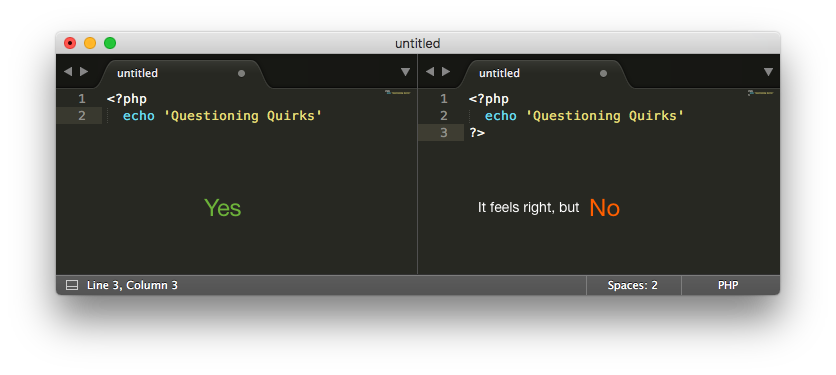

Typically, you'll find my desktop stacked with windows about Javascript & static-site generators, two of my loves, but lately I've been spending time getting to know PHP better. To this point, most of my PHP knowledge comes from tinkering with the PHP templates of posts, pages, etc within WordPress. To become more familiar with the language, I've started primarily using [Laracasts](https://laracasts.com) which has some [advantageous tutorials](https://laracasts.com/series/php-for-beginners) done by [Jeffrey Jordan Way](https://www.quora.com/Why-is-Jeffrey-Jordan-Way-such-an-awesome-kid).

Resources aside, here are some quirks that I've found in my ongoing deep-dive into PHP. To make this list, the behavior has to be some level of strange, mysterious, and other-worldly with at least of few [Stack Overflow](https://stackoverflow.com/documentation/php/topics) questions starting with the words, why on earth.

### Omit Closing Tags on Pure PHP Files
Early on in PHP fundamentals it's taught that if a PHP file has only PHP in it, vs PHP & HTML, then the closing tag (`?>`) is optional. In an attempt to be buttoned up, my inclination was to include them unless there was rationale behind the practice. [SitePoint champions an explanation](https://www.sitepoint.com/should-you-close-your-php-code-tags/) and includes a couple reasons.

1. The closing tag is not needed to run the file. Since it's not necessary, and keeping code [DRY](https://en.wikipedia.org/wiki/Don%27t_repeat_yourself) is [one of the key software principles](https://code.tutsplus.com/tutorials/3-key-software-principles-you-must-understand--net-25161), the tags should be omitted.

2. It can cause conflicts at run time. If the PHP closing tag is included and there is any whitespace or new line after it, then there will be an issue when importing that code in other files using `require`. Since PHP will read until [EOF](https://stackoverflow.com/questions/2405818/does-eof-actually-exist), or end of file, then it will notice the whitespace and load it as part of the file. This is most notably a problem when trying to edit headers with PHP as any extra character after the closing tag will be sent to the page as content. Once the page receives content, the headers cannot be modified and instead will throw an error. Worse yet, if the production server has errors turned off, there will be a silent fail of the entire page. 

### More to Come

Since I'll be neck-deep in PHP continuously, this list will grow each week. That is unless PHP has a limited amount of quirks and if it's initial resemblance to Javascript is any kind of indicator, I'll have reams to discover.
